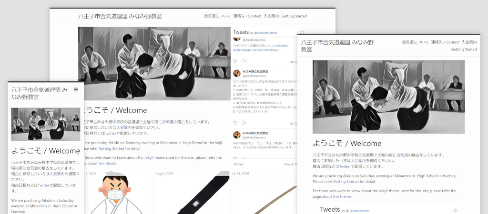

# minamino-aikido

A simple Jekyll theme created to run website of [Minamino Aikido Club](https://aikige.github.io/minamino-aikido/),
based on [minima-2.5.1](https://github.com/jekyll/minima/releases/tag/v2.5.1).

This project is also used as source of the website.

## Notable Features

* Tile like responsive design.
* Support for embedded tweets.
* Support for [Google AdSense](https://www.google.com/adsense).

For detail about theme, please refer [documentation for the theme](docs/index.md).
