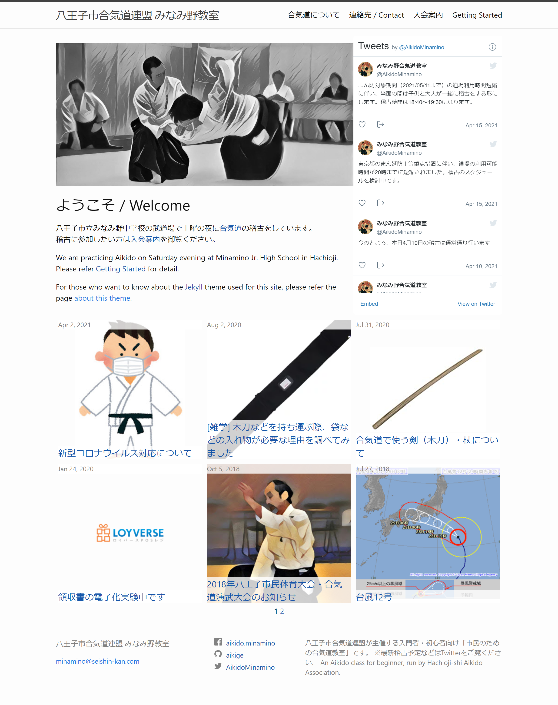

The theme minamino-aikido ([github](https://github.com/aikige/minamino-aikido)) is created for website of [Minamino Aikido Club](https://aikige.github.io/minamino-aikido/), based on [minima-2.5.1](https://github.com/jekyll/minima/releases/tag/v2.5.1).

## Features

* Tile like responsive design.
* Support for embedded tweets.
* Support for [Google AdSense](https://www.google.com/adsense).
* Image alignment control for markdown.

## Layouts / Screenshot

3 types of layouts are exist:

* Home - used as top index of the site.
* Page - used for pages.
* Post - used for blog-posts.

### Home

For wide-enough screen, 3-row based tile-like design is used.

### Page / Post

Simple 1 row design is used for Pages and Blog-Posts.

## Detail about Features

### Embedded Tweets

### Google AdSense

### Image Alignment for Markdown

